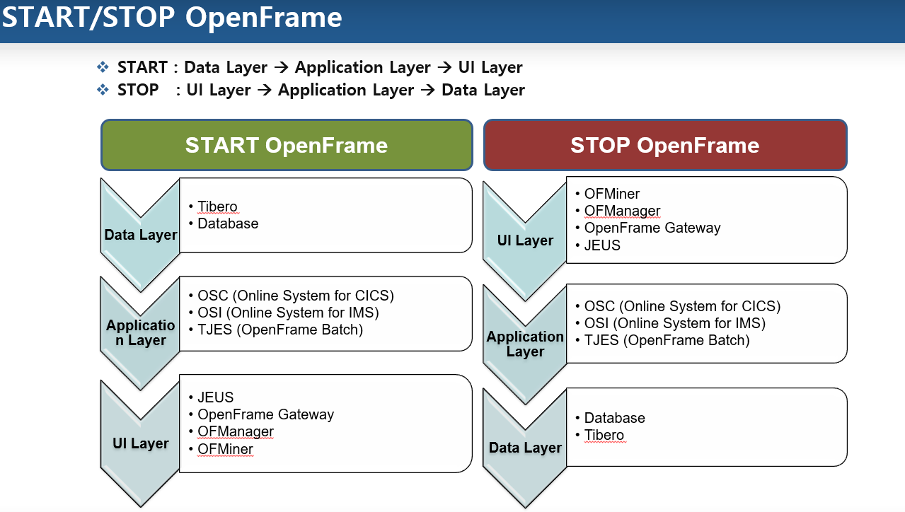
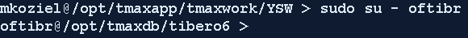
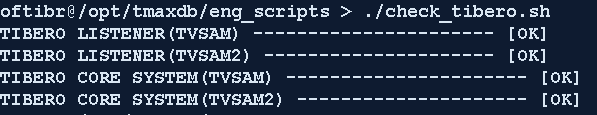
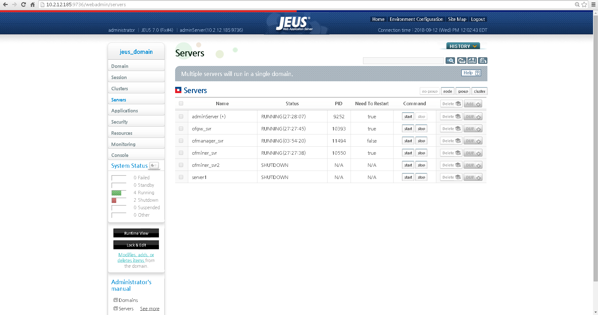
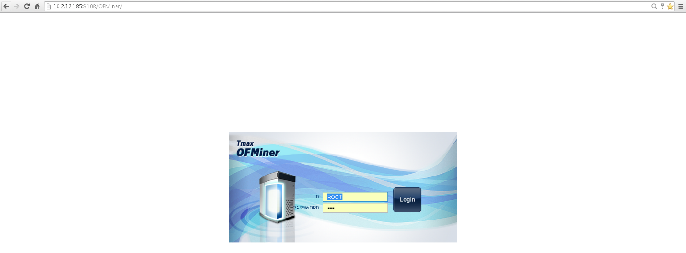
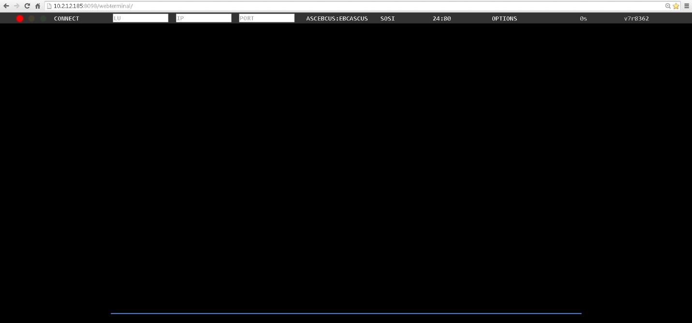
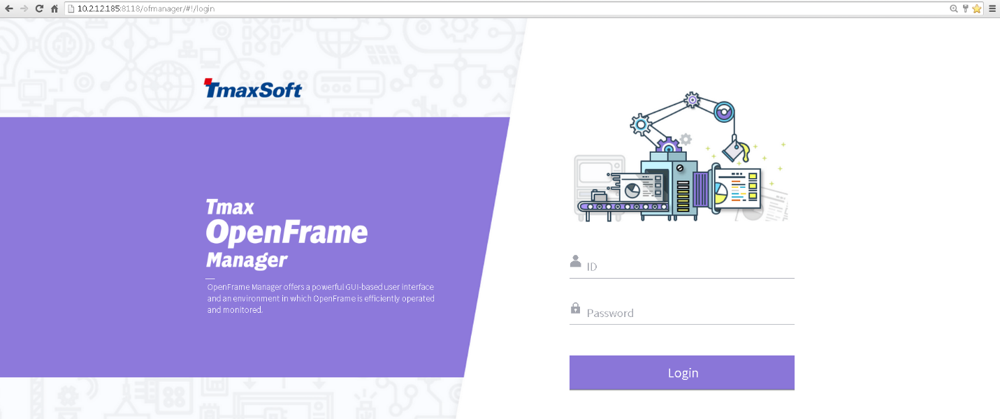

Table of Contents
=================

[Tdlinit 1](#tdlinit)

[Start/Stop OpenFrame 2](#startstop-openframe)

[Tibero – Data Layer (Database) 2](#tibero-data-layer-database)

[Tibero Boot Process 2](#tibero-boot-process)

[Example 1) – Logging in as oftibr user
2](#example-1-logging-in-as-oftibr-user)

[Tibero Boot Verification 2](#tibero-boot-verification)

[Tibero Shutdown Process 3](#tibero-shutdown-process)

[OpenFrame Core – Application Layer
3](#openframe-core-application-layer)

[OpenFrame Core Boot Process 3](#openframe-core-boot-process)

[Example 2) – Logging in as oframe user
3](#example-2-logging-in-as-oframe-user)

[OpenFrame Core Boot Verification 3](#openframe-core-boot-verification)

[OpenFrame Online Boot Process 4](#openframe-online-boot-process)

[OpenFrame Online Boot Verificiation
7](#openframe-online-boot-verificiation)

[Jeus Boot Process 8](#jeus-boot-process)

[Jeus Application Boot Verification
9](#jeus-application-boot-verification)

[Node Manager Boot Process 11](#node-manager-boot-process)

[Booting a web application (OFMiner, OFManager, WebTerminal) through
Jeus
12](#booting-a-web-application-ofminer-ofmanager-webterminal-through-jeus)

[Verifying the Web Application Server has been booted (OFMiner,
OFManager, WebTerminal)
13](#verifying-the-web-application-server-has-been-booted-ofminer-ofmanager-webterminal)

Tdlinit
=======

Once the server has been restarted, run the command:

***tdlinit***

The reason for this command is to initialize TDL shared memory and
dynamic module. tdlinit runs only once when installed and must be run
before booting Tmax.

Start/Stop OpenFrame
====================

Below are the commands to start and stop the OpenFrame system components
and verify if the server processes are running properly

Tibero – Data Layer (Database)
==============================

Tibero Boot Process
-------------------

1.  Ensure you are logged in as the oftibr user  
    From your enterprise ID, issue the command

> ***sudo su – oftibr***

### Example 1) – Logging in as oftibr user

> 

1.  Issue the tbboot command

> ***tbboot***

Tibero Boot Verification
------------------------

1.  Run the shell script check\_tibero.sh. This script checks the server
    processes associated to the TB\_SID of each database instance and
    reports the status back to the user. If there are any issues, they
    will be reported in the error logs located in

    1.  /opt/tmaxdb/eng\_scripts/logs/check\_tibero.err

Any information that was reported out to the user at time of execution
will be located in

1.  /opt/tmaxdb/eng\_scripts/logs/check\_tibero.out

> To run the script, execute the command without any parameters as
> ***oftibr*** user
>
> ***./check\_tibero.sh***
>
> 

Tibero Shutdown Process
-----------------------

1.  Ensure you are logged in as the ***oftibr*** user

    From your enterprise ID, issue the command

> ***sudo su – oftibr***

1.  Issue the tbdown command

> ***tbdown***

OpenFrame Core – Application Layer 
===================================

OpenFrame Core Boot Process
---------------------------

1.  Ensure you are logged in as the ***oframe*** user

    From your enterprise ID, issue the command

> ***sudo su – oframe***

### Example 2) – Logging in as oframe user

> 

1.  Issue the osiboot command

> ***osiboot***

OpenFrame Core Boot Verification
--------------------------------

1.  This step should take place directly after Core Boot Process, so you
    should be logged in as oframe user.

2.  Issue the command tmadmin to see the server processes that are ready

    ***tmadmin***

> Once you issue the above command, you may be curious as to why some of
> the processes are not ready, but this is normal because the processes
> we see below are related to OpenFrame Online, and we have not yet
> booted OpenFrame Online. This will be covered in the next section
>
> If you notice any of the servers that are not inside the red box, that
> are not ready, you can manually boot these servers by issuing the
> command

***tmboot -s ${svrname}***

where svrname is the name you see in the second column

In most cases, booting the servers manually will not be needed.

You can quit out of this menu by typing ***q*** or ***quit***

OpenFrame Online Boot Process
-----------------------------

1.  Ensure you are logged in as the ***oframe*** user

    From your enterprise ID, issue the command

> ***sudo su – oframe***

1.  We will use a shell script with straight forward prompts to bring
    online regions up

    To begin, issue the command below:

    ***sh osiboot.sh -d***

    the -d option deletes temporary files created by the online regions
    that may cause some issues when starting up

OpenFrame Online Boot Verificiation
-----------------------------------

1.  Ensure you are logged in as the ***oframe*** user

    From your enterprise ID, issue the command

> ***sudo su – oframe***

1.  Issue the command tmadmin to see the server processes that are ready

    ***tmadmin***

<!-- -->

1.  Before, these server processes were **NRDY** state, but after this
    boot process, you can see they are now **RDY** state

1.  If we compare IMSPSCHD (IMSP Scheduler), IMSPCMMD (IMSP Command
    Server), IMSKSCHD, and IMSKCMMD to the IMSA and IMST region
    schedulers and commands, we can see the effect of the online boot
    process

    

Jeus Boot Process
-----------------

1.  Ensure you are logged in as the ***oframe*** user

    From your enterprise ID, issue the command

> ***sudo su – oframe***

1.  Issue the command **jboot** to boot the Web Administrator Server
    (WAS)

    ***jboot***

2.  You’ll
    receive a lot of text, the most important information will be
    located at the end of the feedback where you will be notified if
    Jeus was brought up successfully or not

1.  As you can see here, the “Successfully started the server” and “The
    JEUS server is RUNNING”

2.  Additionally, we receive the PID (process ID) of the
    DomainAdminServerBootstrapper

\*\* *An Important note about all Jeus related applications (OFGW,
OFMiner, OFManager, WebAdmin). You can use the command **catdomain** to
see the boot commands, shutdown commands, and web url for each
application. This command requires no parameters. Also note, when we
boot the nodemanager (which will be explained in the next section, that
we will NOT have to use jboot 1-3 commands, we can use the
WebAdminServer(Jeus) to boot the servers. \*\**

*Output of the **catdomain** command:*

*Server IP: 10.2.12.185*

*adminServer(JEUS): 10.2.12.185:9736/webadmin (jboot/jdown\[Shuts down
all jeus apps\]*

*ofgw\_svr: 10.2.12.185:8098/webterminal (jboot 1/jdown 1)*

*ofminer\_svr: 10.2.12.185:8108/OFMiner (jboot 2/jdown 2)*

*ofmanager\_svr: 10.2.12.185/ofmanager (jboot 3/jdown 3)*

*As you can see, issuing **jdown** command without any additional
parameters will shut down ALL jeus related application servers listed
above (adminServer, ofgw\_svr, ofminer\_svr, ofmanager\_svr).*

Jeus Application Boot Verification
----------------------------------

1.  Once the adminServer is booted, you can use the application server
    to view the status of the remaining servers.

<!-- -->

1.  To do this, go to the url of the adminServer
    (10.2.12.185:9736/webadmin)

2.  Login

1.  Navigate
    to the Servers and view the status there

<!-- -->

1.  Alternatively, you can use the **check\_j\_apps.sh** shell script
    similar to the **check\_tibero.sh** shell script

<!-- -->

1.  Ensure you are logged in as the ***oframe*** user

    From your enterprise ID, issue the command

> ***sudo su – oframe***

1.  Invoke the script with the following command (No parameters are
    needed)

    ***sh check\_j\_apps.sh***

<!-- -->

1.  The final way you can check, is to manually visit each url listed
    from the cat domain command.  
    If each web page appears, you have successfully booted the Jeus
    applications.

    JEUS

    

Node Manager Boot Process
-------------------------

1.  Ensure you are logged in as the ***oframe*** user

    From your enterprise ID, issue the command

> ***sudo su – oframe***

1.  Issue the command **nmboot** to boot the node manager

> ***nmboot***

\*\* *An Important note about OFManager, OFMiner, and WebTerminal – You
MUST have the Node manager (using the **nmboot** command ) and the
Domain Admin Server (using the **jboot** command) booted BEFORE booting
OFManager, OFMiner, and WebTerminal. \*\**

Booting a web application (OFMiner, OFManager, WebTerminal) through Jeus
------------------------------------------------------------------------

1.  Type the Jeus URL into a web browser and enter login credentials.

    

2.  Click
    Servers on the left side of the screen (Indicated by the red box)

3.  Click the Start button next to the server you want to boot
    (Indicated by the blue box)

Verifying the Web Application Server has been booted (OFMiner, OFManager, WebTerminal)
--------------------------------------------------------------------------------------

1.  After starting the server, verify by checking the status next to the
    server name

    Below,
    you can see the adminServer(Domain Administrator Server \[JEUS\]),
    ofgw\_svr (WebTerminal), ofmanager\_svr(OFManager), and
    ofminer\_svr(OFMiner) within the blue boxes. And the shutdown
    servers signified by the red box.

2.  We can also verify by simply trying to access the login screens for
    all the applications.

    Below are screenshots of what the login page should look like.

OFMiner

OFGW
(Webterminal)

OFManager

