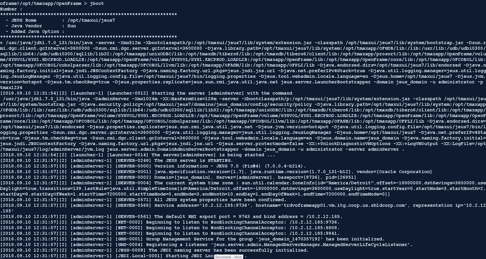
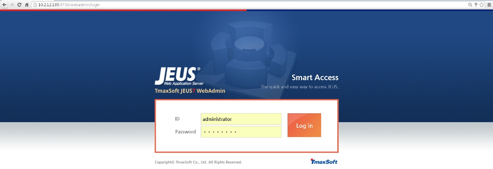

Jeus Boot Process
-----------------

1. Ensure you are logged in as the ***oframe*** user

From your enterprise ID, issue the command

> ***sudo su – oframe***

1. Issue the command **jboot** to boot the Web Administrator Server
(WAS)

***jboot***

2. You’ll
receive a lot of text, the most important information will be
located at the end of the feedback where you will be notified if
Jeus was brought up successfully or not

1. As you can see here, the “Successfully started the server” and “The
JEUS server is RUNNING”

2. Additionally, we receive the PID (process ID) of the
DomainAdminServerBootstrapper

\*\* *An Important note about all Jeus related applications (OFGW,
OFMiner, OFManager, WebAdmin). You can use the command **catdomain** to
see the boot commands, shutdown commands, and web url for each
application. This command requires no parameters. Also note, when we
boot the nodemanager (which will be explained in the next section, that
we will NOT have to use jboot 1-3 commands, we can use the
WebAdminServer(Jeus) to boot the servers. \*\**

*Output of the **catdomain** command:*

*Server IP: 10.2.12.185*

*adminServer(JEUS): 10.2.12.185:9736/webadmin (jboot/jdown\[Shuts down
all jeus apps\]*

*ofgw\_svr: 10.2.12.185:8098/webterminal (jboot 1/jdown 1)*

*ofminer\_svr: 10.2.12.185:8108/OFMiner (jboot 2/jdown 2)*

*ofmanager\_svr: 10.2.12.185/ofmanager (jboot 3/jdown 3)*

*As you can see, issuing **jdown** command without any additional
parameters will shut down ALL jeus related application servers listed
above (adminServer, ofgw\_svr, ofminer\_svr, ofmanager\_svr).*

Jeus Application Boot Verification
----------------------------------

1. Once the adminServer is booted, you can use the application server
to view the status of the remaining servers.

<!-- -->

1. To do this, go to the url of the adminServer
(10.2.12.185:9736/webadmin)

2. Login

1. Navigate
to the Servers and view the status there

<!-- -->

1. Alternatively, you can use the **check\_j\_apps.sh** shell script
similar to the **check\_tibero.sh** shell script

<!-- -->

1. Ensure you are logged in as the ***oframe*** user

From your enterprise ID, issue the command

> ***sudo su – oframe***

1. Invoke the script with the following command (No parameters are
needed)

***sh check\_j\_apps.sh***

<!-- -->

1. The final way you can check, is to manually visit each url listed
from the cat domain command.
If each web page appears, you have successfully booted the Jeus
applications.

JEUS

