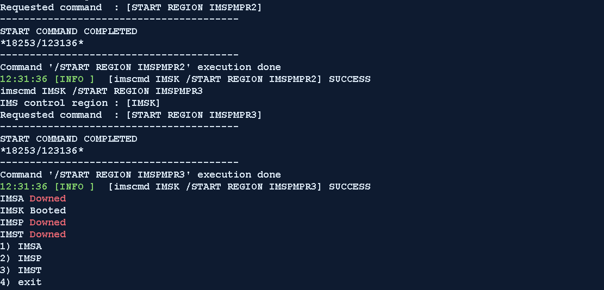
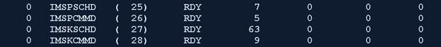
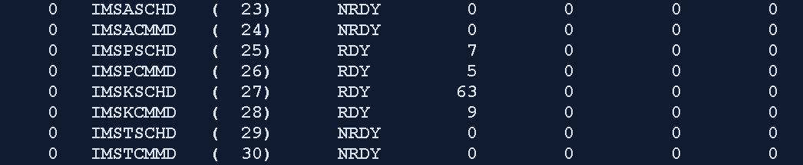

OpenFrame Core – Application Layer
===================================

OpenFrame Core Boot Process
---------------------------

1. Ensure you are logged in as the ***oframe*** user

From your enterprise ID, issue the command

> ***sudo su – oframe***

### Example 2) – Logging in as oframe user

> 

1. Issue the osiboot command

> ***osiboot***

OpenFrame Core Boot Verification
--------------------------------

1. This step should take place directly after Core Boot Process, so you
should be logged in as oframe user.

2. Issue the command tmadmin to see the server processes that are ready

***tmadmin***

> Once you issue the above command, you may be curious as to why some of
> the processes are not ready, but this is normal because the processes
> we see below are related to OpenFrame Online, and we have not yet
> booted OpenFrame Online. This will be covered in the next section
>
> If you notice any of the servers that are not inside the red box, that
> are not ready, you can manually boot these servers by issuing the
> command

***tmboot -s ${svrname}***

where svrname is the name you see in the second column

In most cases, booting the servers manually will not be needed.

You can quit out of this menu by typing ***q*** or ***quit***

OpenFrame Online Boot Process
-----------------------------

1. Ensure you are logged in as the ***oframe*** user

From your enterprise ID, issue the command

> ***sudo su – oframe***

1. We will use a shell script with straight forward prompts to bring
online regions up

To begin, issue the command below:

***sh osiboot.sh -d***

the -d option deletes temporary files created by the online regions
that may cause some issues when starting up

OpenFrame Online Boot Verificiation
-----------------------------------

1. Ensure you are logged in as the ***oframe*** user

From your enterprise ID, issue the command

> ***sudo su – oframe***

1. Issue the command tmadmin to see the server processes that are ready

***tmadmin***

<!-- -->

1. Before, these server processes were **NRDY** state, but after this
boot process, you can see they are now **RDY** state

1. If we compare IMSPSCHD (IMSP Scheduler), IMSPCMMD (IMSP Command
Server), IMSKSCHD, and IMSKCMMD to the IMSA and IMST region
schedulers and commands, we can see the effect of the online boot
process

