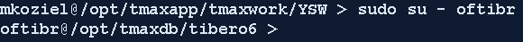
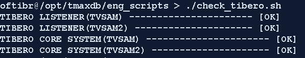

Tibero – Data Layer (Database)
==============================

Tibero Boot Process
-------------------

1. Ensure you are logged in as the oftibr user
From your enterprise ID, issue the command

> ***sudo su – oftibr***

### Example 1) – Logging in as oftibr user

> 

1. Issue the tbboot command

> ***tbboot***

Tibero Boot Verification
------------------------

1. Run the shell script check\_tibero.sh. This script checks the server
processes associated to the TB\_SID of each database instance and
reports the status back to the user. If there are any issues, they
will be reported in the error logs located in

1. /opt/tmaxdb/eng\_scripts/logs/check\_tibero.err

Any information that was reported out to the user at time of execution
will be located in

1. /opt/tmaxdb/eng\_scripts/logs/check\_tibero.out

> To run the script, execute the command without any parameters as
> ***oftibr*** user
>
> ***./check\_tibero.sh***
>
> 

Tibero Shutdown Process
-----------------------

1. Ensure you are logged in as the ***oftibr*** user

From your enterprise ID, issue the command

> ***sudo su – oftibr***

1. Issue the tbdown command

> ***tbdown***