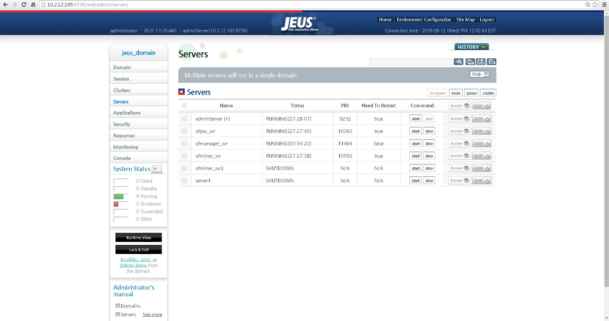
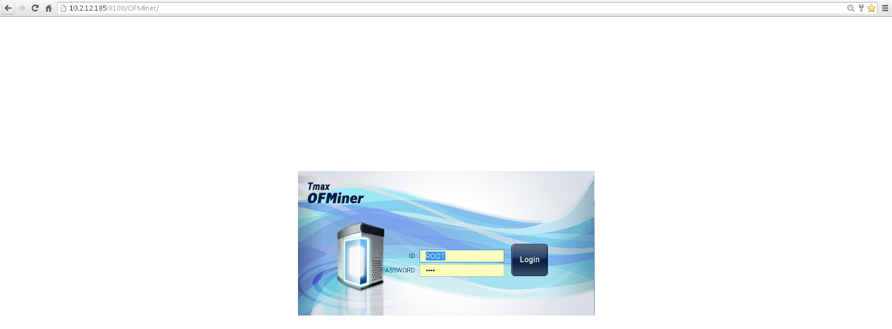
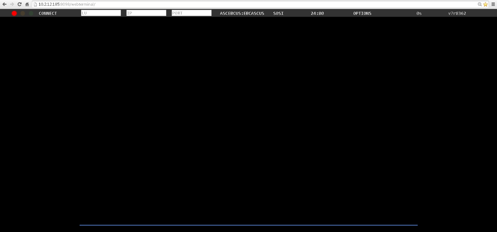
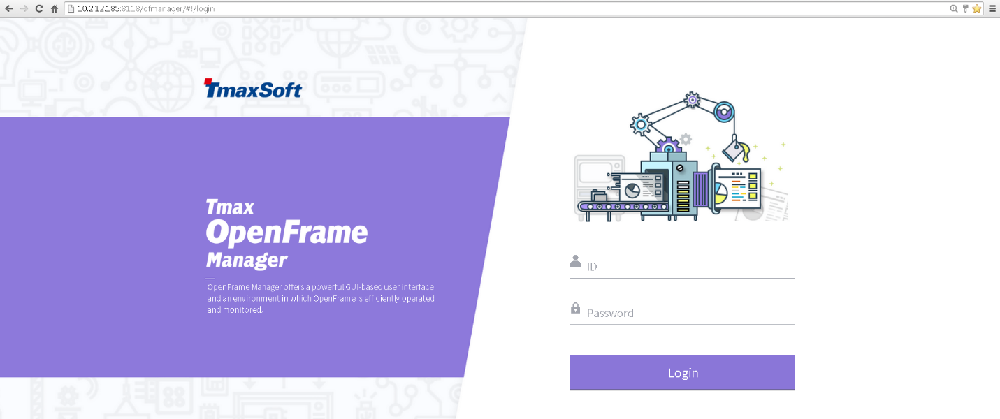

Verifying the Web Application Server has been booted (OFMiner, OFManager, WebTerminal)
--------------------------------------------------------------------------------------

1. After starting the server, verify by checking the status next to the
server name

Below,
you can see the adminServer(Domain Administrator Server \[JEUS\]),
ofgw\_svr (WebTerminal), ofmanager\_svr(OFManager), and
ofminer\_svr(OFMiner) within the blue boxes. And the shutdown
servers signified by the red box.

2. We can also verify by simply trying to access the login screens for
all the applications.

Below are screenshots of what the login page should look like.

OFMiner

OFGW
(Webterminal)

OFManager

